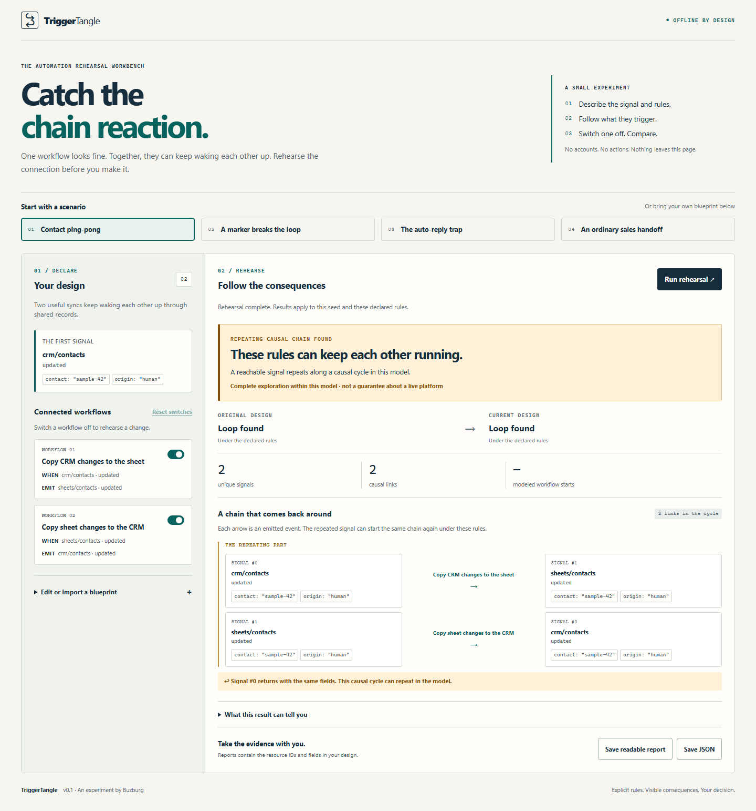

# TriggerTangle

**Will your automations keep waking each other up?**

A CRM update wakes a spreadsheet sync. The spreadsheet update wakes a CRM sync. Both workflows look reasonable on their own. Together, they can repeat.

TriggerTangle rehearses that interaction **before you connect real accounts**. Describe the triggers, emitted events and simple field guards; see a concrete repeating chain; switch off a workflow or try a marker guard and compare the result.



## Try the offline app

1. Download **[trigger-tangle.html from the latest release](https://github.com/Buzburg/trigger-tangle/releases/latest)**.
2. Open it in a current desktop Chromium or Firefox browser. No installation or connection needed.
3. Try contact ping-pong, a marker-guarded sync, an auto-reply loop or an ordinary sales handoff.
4. Open **Build your own two-way sync** to name two resources and try an origin marker without writing JSON. Switch a workflow off to rehearse an intervention; use the advanced editor for larger designs.
5. Export a complete JSON or readable HTML report, including the blueprint that produced it.

No account, model, API key, telemetry, storage or runtime network calls. The app never runs your workflows or changes your accounts. Reports include resource identifiers and sample data; review before sharing.

**This is an explicit design model, not a live n8n/Zapier scanner.** You supply the resource IDs and behavior. Results apply only to the chosen seed and those declarations.

For a public demo, the build also produces `dist/site/index.html`. See [hosting instructions](docs/HOSTING.md) and the [launch assistant plan](docs/GROWTH.md). No site is deployed automatically.

## What makes this useful?

- **External feedback matters.** Workflows connect through exact resource and event identifiers, not only explicit “call workflow” nodes.
- **Show the chain.** A loop report includes the lead-in and a closed, repeating sequence of events, with the fields at each step.
- **Guards are executable declarations.** Supported field checks can actually stop a modeled branch. An incorrectly placed marker does not magically make a loop disappear.
- **Reconvergence is not a loop.** Two branches reaching the same signal are handled separately from a causal cycle.
- **Counts preserve duplicate deliveries.** On complete acyclic designs, report modeled workflow starts and emitted events using exact integers. Merging equivalent states for analysis does not silently deduplicate their deliveries.
- **Limits stay visible.** Reaching the exploration budget produces an incomplete result, never a reassuring “all clear.”

## Use it in an agent or build workflow

Download `trigger-tangle.mjs` from the release. Requires **Node.js 22+**, with no runtime package installation.

```sh
# Reproduce a loop. Exit status 1 is expected.
node trigger-tangle.mjs --example contact-loop

# Rehearse a change without modifying the blueprint on disk.
node trigger-tangle.mjs --example contact-loop --disable sheet-to-crm --format json

# Save an editable starting design.
node trigger-tangle.mjs --example contact-loop --blueprint > blueprint.json

# Check your design and save a complete report.
node trigger-tangle.mjs blueprint.json --format html > rehearsal.html
```

Exit codes: **0** settles for this modeled seed, **1** a loop was found in the model, **2** inconclusive within budget, **3** invalid input or an error. Standard output is the report; errors go to standard error. No input files are rewritten. Keep input files unchanged during the check.

An agent can propose a blueprint and invoke the CLI as a read-only test. It must preserve the stated assumptions and human approval requirements of your actual systems. See [the agent integration guide](docs/AGENT_GUIDE.md).

## A complete small blueprint

```json
{
  "version": 1,
  "name": "Contact ping-pong",
  "seed": {
    "resource": "crm/contacts",
    "event": "updated",
    "data": {"origin": "human"}
  },
  "workflows": [
    {
      "id": "crm-to-sheet",
      "name": "Copy contact to sheet",
      "on": {"resource": "crm/contacts", "event": "updated"},
      "emit": [{"resource": "sheets/contacts", "event": "updated"}]
    },
    {
      "id": "sheet-to-crm",
      "name": "Copy row to CRM",
      "on": {"resource": "sheets/contacts", "event": "updated"},
      "emit": [{"resource": "crm/contacts", "event": "updated"}]
    }
  ]
}
```

A modeled marker intervention adds `"set": {"origin": "contact-sync"}` to each effect and `"when": [{"field": "origin", "op": "notEquals", "value": "contact-sync"}]` to both workflows. This assumes the marker is propagated and the actual platform checks it as declared. It is an example, not an automatic fix for every synchronization design.

## The model's boundaries

Resource IDs and event types match exactly, including capitalization. Every matching enabled workflow evaluates all its conditions against an incoming signal. Each effect copies that signal's fields, removes `unset` keys, then applies constant `set` fields. Sibling effects are independent. No code, expressions or templates are executed.

There is no persistent business-record state, concurrency, retry behavior, timing, changed-only updates, delivery deduplication or probabilistic agent behavior. A discovered cycle can repeat indefinitely under this deterministic model; it does **not** prove that a real service will run away. A settling result does **not** certify a workflow or establish that intended business work still occurs. Disabling everything settles too.

Only one selected seed is checked per rehearsal. Change seeds and validate important business scenarios separately. No automatic n8n/Zapier import is provided in v0.1: hidden resource expressions and platform conditions require accurate modeling, not optimistic guesses.

Default budget: 256 unique signal states and 2,048 transition edges. Maximum: 512 states / 8,192 edges. Input has a 200,000-character limit, 100 workflows and 32 distinct data fields. See the complete [blueprint reference](docs/BLUEPRINT.md), [design contract](docs/DESIGN.md) and [security boundaries](SECURITY.md).

## Build and test

```sh
npm ci --ignore-scripts
npm run typecheck
npm test
npx playwright install chromium firefox
npm run test:browser
```

The build produces a self-contained HTML app, a bundled CLI and SHA-256 checksums. Tests include a separate exhaustive small-graph cycle oracle, exact delivery counts, invalid inputs, browser behavior and actual CLI invocations. See the [verification record](docs/VERIFICATION.md). GitHub Actions rebuilds and tests before publishing release files. Verify downloaded files against `SHA256SUMS.txt`; checksums detect changed bytes but are not an independent publisher signature.

## Existing work and the narrow gap

Cycle detection and trigger-action verification are established ideas. n8n visualizers already map explicit subworkflow dependencies; Entflow offers HubSpot-specific dependency analysis; TAPInspector researches interacting trigger-action systems. TriggerTangle packages a smaller, platform-neutral design rehearsal around external event feedback and a reviewable before/after intervention. [Research and alternatives](docs/RESEARCH.md) record the evidence and limits of that claim.

MIT licensed. Built by [Buzburg](https://github.com/Buzburg).
